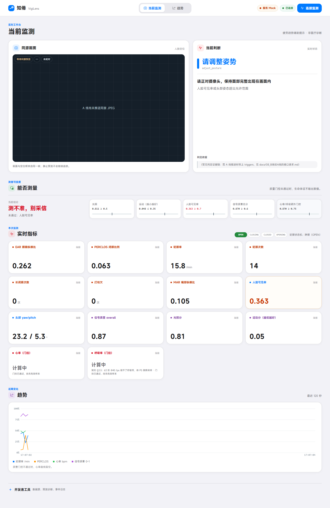
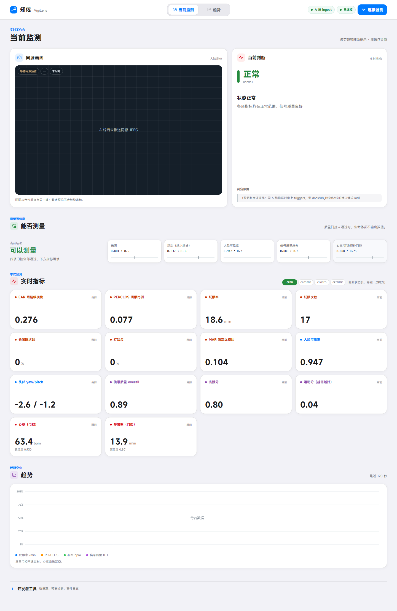
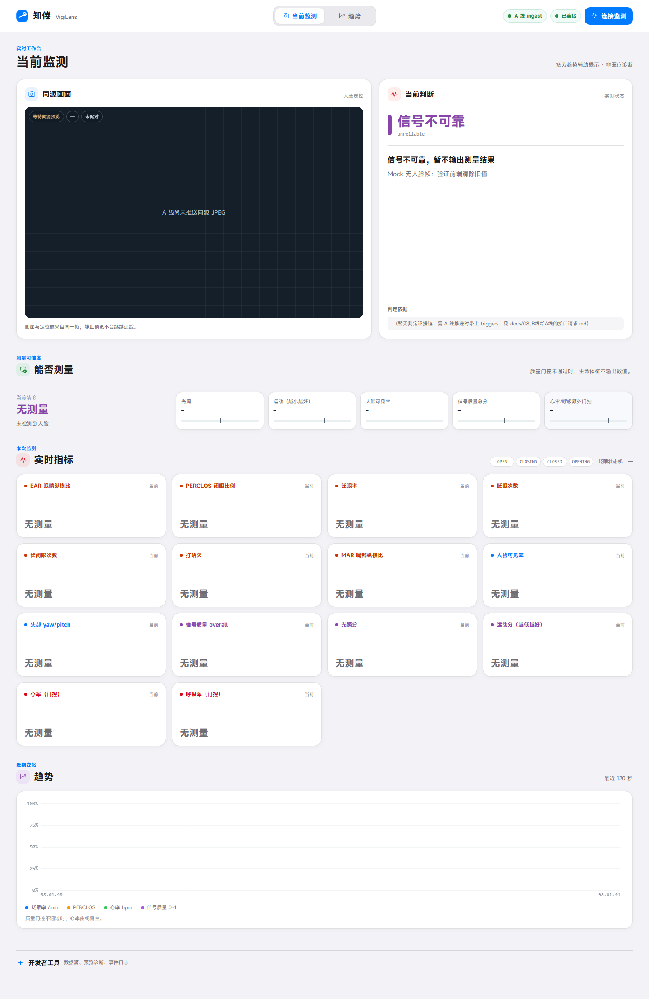
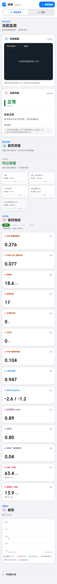

# B8 浅色信息工作台截图证据（2026-10-04）

> 归档：**B 线**。本页只证明前端显示、数据来源标识和响应式布局；**不证明算法准确率或真实性能**。

## 数据来源声明

全部截图和浏览器检查均使用 `frontend/mock.js` / `backend/mock.py` 生成的确定性 Mock 帧，未使用、上传或归档任何真人视频。

- 「服务 Mock」表示 `api.py` 自带的 B 线模拟数据源。
- 「A 线 ingest」只表示帧经 `/api/ingest` 进入服务；本页截图里的帧仍是 Mock，**不是 A 线真实算法结果**。
- 截图中的心率、呼吸率等数字只用于验证 UI 布局，不得作为实验结果引用。

## 截图

### 服务 Mock · 桌面



### ingest Mock 正常态 · 桌面



### ingest Mock 无人脸 · 桌面



### ingest Mock 正常态 · 390 px 移动端



## 浏览器验收

环境：本机 Microsoft Edge headless，通过 `metrics/scripts/check_b_line_browser.mjs` 的 Chrome DevTools Protocol 驱动；脚本不依赖 npm 包。

实际覆盖：

- `normal`、`unreliable`、`disconnected`、`done` 和无人脸 `unreliable` 帧均通过 DOM 断言。
- 无人脸时 14 张指标卡均显示「无测量」，5 条门控值均为「—」，眨眼状态无高亮。
- `disconnected` 优先显示「无数据」，不被 `face.visible == 0` 误判为「无测量」。
- 桌面 1440×900 与移动端 390×844 均未检测到横向溢出。
- 默认服务显示「服务 Mock」；`--no-mock` 服务显示「A 线 ingest」，连接状态独立显示「已连接」。
- 页面连接独立 `backend/websocket.py` 时显示「来源未声明」，不会误读托管页自身的 `/api/status.source`。

复现命令（终端 1）：

```powershell
.venv\Scripts\python.exe backend\api.py --no-mock --port 8897
```

复现命令（终端 2）：

```powershell
node metrics\scripts\check_b_line_browser.mjs --scenario normal
node metrics\scripts\check_b_line_browser.mjs --scenario unreliable
node metrics\scripts\check_b_line_browser.mjs --scenario disconnected
node metrics\scripts\check_b_line_browser.mjs --scenario done
node metrics\scripts\check_b_line_browser.mjs --scenario noface
node metrics\scripts\check_b_line_browser.mjs --scenario normal --width 390 --height 844
```

「服务 Mock」标签另用不带 `--no-mock` 的 `api.py` 复验：

```powershell
node metrics\scripts\check_b_line_browser.mjs --source mock
```

独立 WebSocket 来源隔离另起 `backend/websocket.py` 后复验：

```powershell
node metrics\scripts\check_b_line_browser.mjs --source standalone --ws-url ws://127.0.0.1:8765
```
